[목차] 
[1. 게임명 : 몬스터즈](#게임명--몬스터즈) 
[2. 몬스터즈 컨셉](#컨셉) 
[3. 관련 이미지 & 동영상](#관련-이미지--동영상) 
[4. 몬스터즈 대표 이미지](#대표-이미지) 
[5. 대표 이미지 기반 작품묘사](#대표-이미지-기반-작품-묘사) 
[6. 몬스터즈 구성 요소](#몬스터-구성-요소) 
[7. 게임 시스템 디자인](#게임-시스템-디자인) 
	[a. 게임 오브젝트 분해](#1-게임-오브젝트-분해-구성-요소-분석) 
	[b. 파라미터(속성)](#2-파라미터속성-뽑아-보기) 
	[c. 행동](#3-행동-뽑아-보기) 
	[d. 상태](#4-상태-뽑아-보기) 
	[e. 플레이어 캐릭터 속성(파라미터)](#5-플레이어-캐릭터-속성-파라미터) 
	[f. 게임의 규칙](#6-게임의-규칙) 
	[g. 게임에서 사용될 공식](#7-게임에서-사용될-공식) 
[8. 개발 요구사항 & 흐름도](#개발-요구사항--흐름도) 
	[a. 요구사항(1년/6주)](#1-개발-요구사항) 
	[b. 키보드 이벤트에 대한 흐름도](#2-키보드-이벤트에-대한-흐름도) 
	[c. 용어정리](#3-용어-정리) 
[9. 개발작업 일정(6주)](#개발작업-일정6주) 
*********************
  

# [게임명 : 몬스터즈]

  

# [컨셉]
## <strong>메인컨셉_ 몬스터</strong>
- 플레이어가 몬스터와 전투를 벌인다. 다양한 몬스터 하나하나가 각각의 다른 개성을 갖고 강점, 약점을 소유한다. 

### <strong>서브 컨셉 1 : 개성</strong>
- 전투를 벌이는 몬스터들은 고유의 특징과 개성을 갖고 플레이어가 매번 색다른 전투 경험을 갖게 해준다.

### <strong>서브 컨셉 2 : 도트</strong>
-  2D 장르의 특권이라 할 수 있는 도트그래픽을 사용하여 3D게임에서는 볼 수 없는 아름다움을 보여준다.

### <strong>서브 컨셉 3 : 성장</strong>
- 캐릭터는 천천히 성장하며 성장할수록 보다 더 어렵고 강력한 몬스터가 등장하고 전투의 난이도가 증가한다.

### <strong>서브 컨셉 4 : 기술</strong>
- 캐릭터가 성장하며 전투를 할수록 다양한 기술들을 나타내고 다양한 기술을 필요로하는 전투를 제공한다.

### <strong>서브 컨셉 5 : 난이도</strong>
- 개성있는 전투를 펼치고 그 경험들을 응용해야 할 것이며 그 난이도는 점점 어려워질것이다.  

*********************
   

# [관련 이미지 & 동영상]
- 이미지 
  
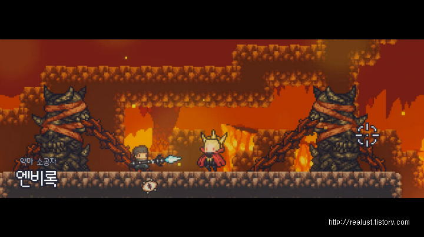
  
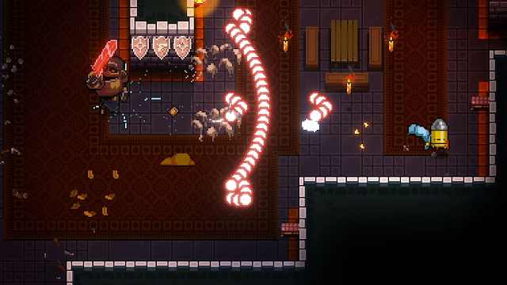
   
- 동영상
  

*********************
   

# [대표 이미지]

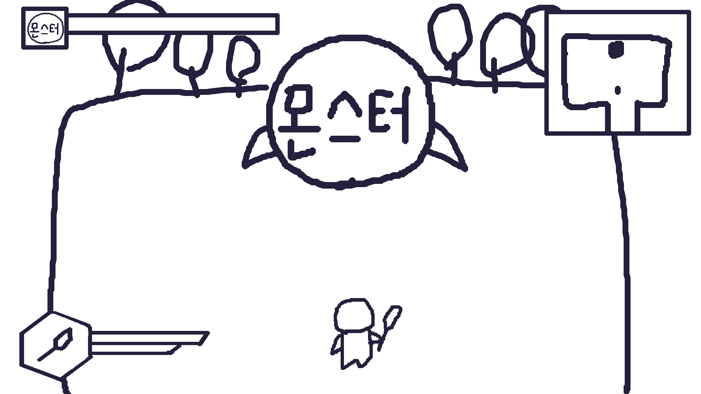

 

# [대표 이미지 기반 작품 묘사]

> ### 대표이미지 기반 : 게임은 탑뷰형식의 2D RPG 장르입니다.

 

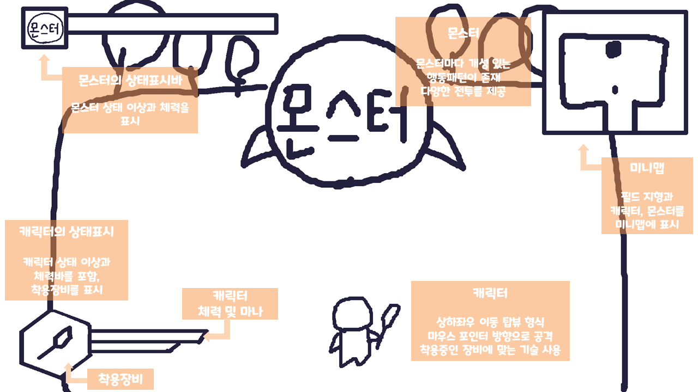

*********************
   

# [<strong>몬스터 구성 요소</strong>]

## 1. 메커니즘

>- 도전 과제
>1. 캐릭터의 체력이 소진되기 전에 몬스터를 처치하라.
>2. 게임 내 존재하는 다양한 몬스터를 토벌하라.

>- 재미 요소
>1. 다양한 몬스터와 다양한 전투를 펼친다.
>2. 몬스터와 전투를 하면 캐릭터가 성장하며 강해진다.
>3. 강해진 캐릭터로 더욱 강한 몬스터와 전투할 수 있다.
>4. 본인에게 맞는 장비를 착용하며 개성 있는 플레이스타일을 만들어낸다.

 

## 2. 이야기

> 캐릭터는 시작 섬에서 출발하여 다양한 섬을 탐험하며 다양한 몬스터를 만나는 것이 주된 이야기입니다. 섬에 가서 탐험하며 만나는 몬스터를 토벌하여 다른 섬을 갈 수 있는 발판을 마련합니다. 섬마다 존재하는 악한 몬스터를 처치하는 것이 캐릭터의 목표입니다. 

 

## 3. 미적요소

>[디자인] 
몬스터의 디자인은 섬의 테마와 몬스터의 특징에 알맞게 그려질 것입니다.
최대한 부드러운 색감을 통해 게임의 전체적인 이미지가 어둡지 않게 표현할 것입니다.

>[카메라] 
카메라는 탑 뷰 형식을 채택하여 대부분의 사물은 앞면이 표현되고 캐릭터는 상하좌우로 움직이며 캐릭터의 앞면과 뒷면이 표현될 것입니다.

>[음향]  
도트의 감성을 살릴수 있는 비트음악을 담을 것입니다.
	
 

## 4. 기술  
Unity Engine(2019.4.9f1_win) 사용 

*********************
   

# [<strong>게임 시스템 디자인</strong>]

## 1. 게임 오브젝트 분해 (구성 요소 분석)

|  
연번
 |  
오브젝트 이름
 |  
오브젝트 이미지
 |
|:--------:|:--------:|:--------:|
|**1** | 
캐릭터 (플레이어) 
 |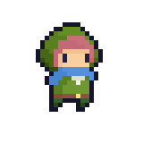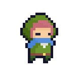 |
|**2** | 
베이스 캠프 (플레이어 홈) 
 |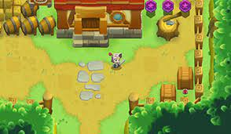 |
|**3** | 
필드 (월드) 
 |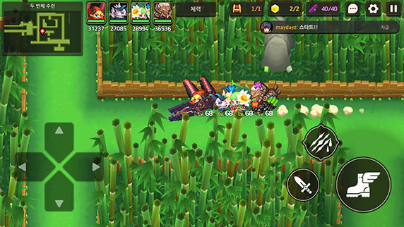 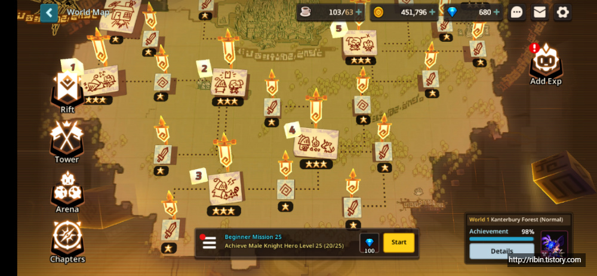 |
|**4** | 
캐릭터 무기
 |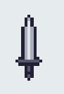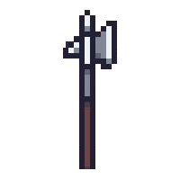|
|**5** | 
몬스터
 |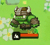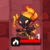 |
|**6** | 
네임드 몬스터
 |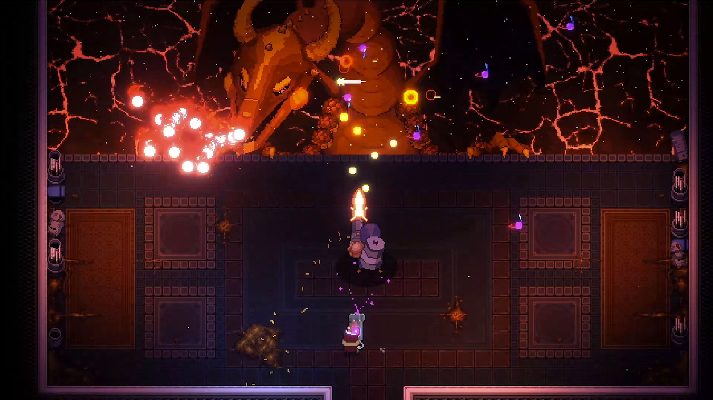 |

  

## 2. 파라미터(속성) 뽑아 보기

 

### 1) 오브젝트 이름: 캐릭터 (플레이어)

|  
속성
 |  
속성값
 |  
설명
 |  
비고
 |
|:--------:|:--------:|:--------:|:--------:|
|
체력
 | 
100
 | 
캐릭터가 몬스터에게 피격 시 일정량의 체력 손실.0에 도달했을때 플레이어 사망. 체력 최대값을 증가시키는 방법( 아이템 등)이 있음.
|

 |
|
방어력
 | 
10
 |
캐릭터가 몬스터에게 피격 시 방어력에 따라 체력 손실값이 다름. 몬스터마다 요구되는 방어력값이 존재. 몬스터가 요구하는 방어력에 미달시 그 몬스터에게 피격 시 체력 손실이 부족한 방어력 값에 따라 최대 1.5배까지 증가.
 |

 |
|
공격력
 | 
10
 |
캐릭터가 몬스터를 타격 시 공격력에 따라 몬스터의 체력 손실값이 다름. 공격력은 아이템 능력치에 따른 증가가 있음.
 |

 |
|
이동속도
 | 
10
 |
캐릭터가 이동할 때의 속력값. 장착한 무기와 아이템에 따라 이동속도가 증가하거나 감소할 수 있음.
 |

 |
|
상태이상
 | 

 |
캐릭터가 가질 수 있는 상태이상. 캐릭터가 사용하는 기술, 아이템에 따라 캐릭터의 상태이상이 추가 될 수 있음. 몬스터의 특정 패턴에 피격 시 주어지는 상태이상이 있음. 종류로는 무적, 기절, 독(DOT damage) 등이 있음.
 |

 |
|
스테이터스
 | 

 |
필드를 일정구역 탐험하게되면 캐릭터 능력치에 투자할 수 있는 스테이터스 제공. 캐릭터의 체력, 방어력, 공격력에 투자 가능함.
 |
 *미확정* 
 |
| 

 |

 |

 |

 |

 

### 2) 오브젝트 이름: 베이스 캠프 (플레이어 홈)

|  
속성
 |  
속성값
 |  
설명
 |  
비고
 |
|:--------:|:--------:|:--------:|:--------:|
| 
무기고
 |

 |
캐릭터가 베이스 캠프에서 상호작용 할 수 있는 객체. 무기고는 캐릭터가 수집한 무기를 나열함. 무기고에서 캐릭터가 착용하고 있는 무기를 해제, 원하는 무기로 교체, 장착 할 수 있음.
 |

 |
| 
창고
 |

 |
캐릭터가 베이스 캠프에서 상호작용 할 수 있는 객체. 창고는 캐릭터가 수집한 아이템들을 나열함. 창고에서 캐릭터가 착용하고 있는 아이템을 해제, 원하는 아이템으로 교체, 장착 할 수 있음. 
 |

 |

 

### 3) 오브젝트 이름: 필드 (월드)

|  
속성
 |  
속성값
 |  
설명
 |  
비고
 |
|:--------:|:--------:|:--------:|:--------:|
| 
지형
 |

 |
캐릭터가 월드에서 이동 가능한 곳. 지형에 따라 캐릭터의 이동속도의 변화(이동속도 저하 등)가 생길 수 있다. 
 |
*흙, 모래, 진흙*  
 |
| 
장애물
 |

 |
캐릭터가 이동할 수 없는 지형. 장애물은 캐릭터가 통과 하지 못함.
 |
*바위, 나무, 수풀*  
 |

 

### 4) 오브젝트 이름: 캐릭터 무기

|  
속성
 |  
속성값
 |  
설명
 |  
비고
 |
|:--------:|:--------:|:--------:|:--------:|
| 
종류
 |

 |
무기의 종류. 단검, 한손검, 두손검, 도끼, 창, 레이피어 등
 |

 |
| 
무기 공격력
 |
5
 |
무기가 가지는 공격력. 무기의 종류에 따라, 가치에 따라 다른 무기 공격력을 보유. 캐릭터의 공격력 상승에 기여. 
 |
*무기에 따라 다름*
 |
| 
공격 속도
 |
1 - 4
 |
무기가 가지는 공격 속도. 무기의 종류에 따라, 가치에 따라 다른 공격 속도를 보유. 1단계부터 4단계까지 단계별로 캐릭터가 분당 공격할 수 있는 횟수가 증가.
 |
*"*
 |
| 
공격 범위
 |

 |
무기가 타격할 수 있는 범위. 무기의 종류에 따라, 가치에 따라 다른 범위를 보유. 공격 범위는 무기의 종류에 큰 영향을 받음. 
 |
*"*
 |
| 
가치
 |
1 - 5
 |
무기가 갖고 있는 가치. 가치의 수치가 높을 수록 그만큼 영향력이 높은(가치가 낮은 무기보다 공격력, 공격속도, 공격범위가 우월함.) 무기. 
 |
*"*
 |
| 
무기 기술
 |

 |
무기의 종류에 따라 무기가 갖고 있는 기술.
 |
*"*
 |
| 
무기 변수
 |
1 - 5
 |
무기의 종류에 따라 무기가 갖고 있는 변수. 캐릭터가 몬스터 에게 주는 데미지 값에 영향을 줌.
 |
*수치가 높을수록 데미지값의 편차가 심해짐*
 |

 

### 5) 오브젝트 이름: 몬스터

|  
속성
 |  
속성값
 |  
설명
 |  
비고
 |
|:--------:|:--------:|:--------:|:--------:|
| 
체력
 |
100
 |
몬스터가 캐릭터에게 피격 시 일정량의 체력 손실. 0에 도달했을때 몬스터 사망. 몬스터에 따라 갖고 있는 체력값이 다름.
 |
*몬스터에 따라 다름*
 |
| 
공격력
 |
10
 |
몬스터가 캐릭터를 타격 시 공격력에 따라 캐릭터의 체력 손실값이 다름. 몬스터에 따라 갖고 있는 공격력값이 다름.
 |
*"*
 |
| 
이동속도
 |
5
 |
몬스터가가 이동할 때의 속력값. 
 |
*"*
 |
| 
몬스터 기술(행동)
 |

 |
몬스터가 갖는 고유의 기술 또는 행동. 캐릭터를 타격 하는 기술, 캐릭터를 방해하는 기술 등.
 |
*"*
 |

 

### 6) 오브젝트 이름: 네임드 몬스터

|  
속성
 |  
속성값
 |  
설명
 |  
비고
 |
|:--------:|:--------:|:--------:|:--------:|
| 
체력
 |

 |
몬스터가 캐릭터에게 피격 시 일정량의 체력 손실. 0에 도달했을때 몬스터 사망. 몬스터에 따라 갖고 있는 체력값이 다름.
 |
*몬스터에 따라 다름*
 |
| 
공격력
 |

 |
몬스터가 캐릭터를 타격 시 공격력에 따라 캐릭터의 체력 손실값이 다름. 몬스터에 따라 갖고 있는 공격력값이 다름.
 |
*"*
 |
| 
이동속도
 |

 |
몬스터가가 이동할 때의 속력값. 
 |
*"*
 |
| 
몬스터 기술(행동)
 |

 |
몬스터가 갖는 고유의 기술 또는 행동. 캐릭터를 타격 하는 기술, 캐릭터를 방해하는 기술 등.
 |
*"*
 |
| 
방어구 관통력
 |

 |
몬스터가 캐릭터를 타격 시 캐릭터가 갖고 있는 방어력이 몬스터가 갖고 있는 방어구 관통력값보다 낮을 때, 캐릭터의 체력 손실 값이 증가.
 |
*몬스터 방어구 관통력 공식 참고*
 |

  

## 3. 행동 뽑아 보기

### 1) 오브젝트 이름: 캐릭터 (플레이어)

|  
행동
 |  
설명
 |  
비고
 |
|:--------:|:--------:|:--------:|
| 
이동
 |
캐릭터는 이동이 가능한 지형 위에서 상하좌우 이동이 가능함.
 |

 |
| 
공격
 |
캐릭터는 공격이 가능한 상태에서 원하는 방향으로 공격이 가능함.
 |

 |
| 
기술 시전
 |
캐릭터는 공격이 가능한 상태에서 원하는 방향으로 기술을 시전 가능함.
 |
*무기에 따라 시전할 수 있는 기술이다름*
 |
| 
상호작용
 |
캐릭터는 상호작용이 가능한 오브젝트 주위에서 오브젝트와 상호작용이 가능함.
 |

 |

 

### 2) 오브젝트 이름: 몬스터 (네임드 몬스터)

|  
행동
 |  
설명
 |  
비고
 |
|:--------:|:--------:|:--------:|
| 
이동
 |
몬스터는 이동이 가능한 지형 위에서 상하좌우 이동이 가능함.
 |
*이동이 가능한 몬스터에 한에서*
 |
| 
공격
 |
몬스터는 공격이 가능한 상태에서 캐릭터 방면으로 공격 행위를 함.
 |

 |
| 
기술(행동) 시전
 |
몬스터는 공격이 가능한 상태에서 캐릭터 방면으로 기술을 시전하거나 캐릭터를 방해하는 행동을 보임.
 |
*기술(행동) 시전이 가능한 몬스터에 한에서*
 |

  

## 4. 상태 뽑아 보기

 

### 1) 오브젝트 이름: 캐릭터 (플레이어)

|  
현 상태
 |  
전이 상태
 |  
조건
 |  
비고
 |
|:--------:|:--------:|:--------:|:--------:|
| 
일반 상태
 |
피격 상태
 |
캐릭터가 몬스터에게 피격 당한 상태. 피격 후 1초간 피격당하지 않음.
 |

 |
| 
일반 상태
 |
기절 상태
 |
캐릭터가 몬스터에게 특정 기술(행동)로 피격 당했을 때 캐릭터의 움직임이 마비되고 공격 행동을 할 수 없는 기절 상태로 전환. 몬스터의 기술(행동)에 따라 기절 시간은 상이함. 기절 시간이 지난 후 캐릭터는 일반 상태로 전환.
 |

 |
| 
일반 상태
 |
중독 상태
 |
캐릭터가 몬스터에게 특정 기술(행동)로 피격 당했을 때 캐릭터가 독데미지를 입는 상태 추가. 일정 시간동안 일정 간격으로 피해를 입하고 중독 시간이 지난 후 중독 상태 해제.
 |

 |
| 
일반 상태
 |
무적 상태
 |
캐릭터가 특정 아이템 혹은 기술 시전시 무적 상태로 전환. 사용한 아이템, 기술에 따라 무적 시간은 상이함. 무적 상태일 시 몬스터에게 피격당하지 않음.
 |

 |
| 
일반 상태
 |
사망 상태
 |
캐릭터가 피격 후 체력을 모두 소진했을 때 사망 상태로 전환. 캐릭터는 동작하지 못하며 플레이어는 사망 후 출력되는 UI를 통해 게임 조작 가능.
 |

 |

 

### 2) 오브젝트 이름: 몬스터 (네임드 몬스터)

|  
현 상태
 |  
전이 상태
 |  
조건
 |  
비고
 |
|:--------:|:--------:|:--------:|:--------:|
| 
일반 상태
 |
피격 상태
 |
몬스터가 캐릭터에게 피격 당한 상태.
 |

 |
| 
일반 상태
 |
기절 상태
 |
몬스터가 캐릭터에게 특정 기술로 피격 당했을 때 몬스터의 움직임이 마비되고 공격 행동을 할 수 없는 기절 상태로 전환. 캐릭터의 기술(행동)에 따라 기절 시간은 상이함. 기절 시간이 지난 후 몬스터는 일반 상태로 전환.
 |
*효과가 없는 몬스터가 존재함.*
 |
| 
일반 상태
 |
중독 상태
 |
몬스터가 캐릭터에게 특정 기술로 피격 당했을 때 몬스터가 독데미지를 입는 상태 추가. 일정 시간동안 일정 간격으로 피해를 입하고 중독 시간이 지난 후 중독 상태 해제.
 |
*효과가 없는 몬스터가 존재함.*
 |
| 
일반 상태
 |
기술(행동)시전 상태
 |
몬스터가 기술(행동)을 시전 하는 상태. 
 |

 |
| 
일반 상태
 |
사망 상태
 |
몬스터가 피격후 체력을 모두 소진했을 때 사망 상태로 전환.
 |

 |

  

## 5. 플레이어 캐릭터 속성 (파라미터)

|  
속성
 |  
영문 명칭
 |  
설명
 |  
비고
 |
|:--------:|:--------:|:--------:|:--------:|
| 
체력
 |
hitPont
 |
캐릭터가 갖고 있는 현재 체력을 나타내는 속성. 최대 체력을 초과하여 값을 가질 수 없음.
 |

 |
| 
최대 체력
 |
maxHitPoint
 |
캐릭터가 가질 수 있는 체력의 최대값.
 |

 |
| 
공격력
 |
attackPower
 |
공격력 값은 적에게 데미지를 줄 때 영향을 미침.
 |

 |
| 
방어력
 |
defenseValue
 |
방어력 값은 적에게 데미지를 받을 때 영향을 미침.
 |
*몬스터 방어구 관통력 공식 참고*
 |
| 
이동 속도
 |
speedValue
 |
이동 속도 값은 캐릭터의 이동 속도에 영향을 미침.
 |

 |
| 
데미지
 |
cha_damageValue
 |
캐릭터의 공격력과 캐릭터가 착용한 무기의 무기 공격력, 무기 변수가 모두 고려되어 책정되는 값. 몬스터를 타격 시 몬스터의 체력을 소모 시키는 값.
 |
*캐릭터 데미지 공식 참고*
 |

  

## 6. 게임의 규칙
 

### 1) 핵심 규칙
>- 플레이어는 주어진 필드내에 있는 몬스터를 처치한다.
>- 몬스터를 처치 후 주어지는 보상으로 난이도가 있는 월드에 도전한다.
### 2) 보조 규칙
>- 난이도가 높아질수록 캐릭터의 공격력, 방어력, 체력 등이 더 높은 수치를 필요로 한다.
>- 난이도가 높아질수록 몬스터는 더 높은 공격력, 방어구관통력, 체력 등을 소유하고 있다. 그만큼 난이도가 높은 몬스터를 처지시 더 나은 보상을 캐릭터에게 제공한다. 

  

## 7. 게임에서 사용될 공식

> 1. 몬스터 방어구 관통력 공식
>
> 캐릭터의 방어력 < ( 몬스터의 방어구 관통력 - 5 ) = 캐릭터가 받는 데미지 * 2.0  
> 캐릭터의 방어력 > ( 몬스터의 방어구 관통력 - 5 ) && 캐릭터의 방어력 < 몬스터의 방어구 관통력 = 캐릭터가 받는 데미지 * 1.2  
> 캐릭터의 방어력 > 몬스터의 방어구 관통력 && 캐릭터의 방어력 < ( 몬스터의 방어구 관통력 + 5 ) = 캐릭터가 받는 데미지 * 1.0  
> 캐릭터의 방어력 > (몬스터의 방어구 관통력 + 5) = 캐릭터가 받는 데미지 * 0.9  
>
> 예시) 몬스터 A의 방어구 관통력 값이 10일 때  
> 캐릭터의 방어력이 5미만이면 캐릭더가 받는 데미지 2배  
> 캐릭터의 방어력이 5이상 10미만이면 캐릭터가 받는 데미지 1.2배  
> 캐릭터의 방어력이 10이상 15미만이면 캐릭터가 받는 데미지 1배  
> 캐릭터의 방어력이 15이상이면 캐릭터가 받는 데미지 0.9배   

> 2. 캐릭터 데미지 공식
> 
> 캐릭터 공격력과 무기 공격력을 더한 값을 무기 변수 값의 범위 내에서 곱하여 데미지값 산출.  
> 무기 변수 값은 1부터 5까지 존재.  

|  
무기 변수
 |  
범위
 |
|:--------:|:--------:|
|
1
 | 
0.95~1.05
 |
|
2
 | 
0.90~1.10
 |
|
3
 | 
0.85~1.15
 |
|
4
 | 
0.80~1.20
 |
|
5
 | 
0.75~1.25
 |

> 최소 데미지  
> ( 캐릭터 공격력 + 무기 공격력 ) * 무기 변수 범위 최솟값
>  
> 최대 데미지  
> ( 캐릭터 공격력 + 무기 공격력 ) * 무기 변수 범위 최댓값  
>  
> 예시 1) 캐릭터의 공격력이 10, 무기 공격력이 5, 무기 변수값이 2일때  
> 최소 데미지 : ( 10 + 5 ) * 0.9 = 13.5  
> 최대 데미지 : ( 10 + 5 ) * 1.1 = 16.5  
>  
> 예시 2) 캐릭터의 공격력이 100, 무기 공격력이 80, 무기 변수값이 5일때  
> 최소 데미지 : ( 100 + 80 ) * 0.75 = 135  
> 최대 데미지 : ( 100 + 80 ) * 1.25 = 225   

> 3. 몬스터 데미지 공식
>
> 몬스터 공격력 * 0.9 ~ 1.1 = 캐릭터가 받는 데미지 
> 몬스터 방어구 관통력 공식과 함께 계산되어 최종적으로 캐릭터가 받는 데미지 산출 

  

# [<strong>개발 요구사항 & 흐름도</strong>]

## 1. 개발 요구사항

>- 시작 화면, 설정 화면, 시작하기 화면, 게임 화면 4개의 화면으로 구성
>- 시작화면에는 시작, 설정, 끝내기 3개의 버튼이 있다.
>- 설정 버튼을 클릭 시 설정화면으로 이동한다.
>- 설정화면에는 게임 내 배경음의 음량을 조절하는 스크롤, 게임 내 효과음의 음량을 조절하는 스크롤, 다시 시작화면으로 돌아가는 돌아가기 버튼이 있다.
>- 시작 버튼을 클릭 시 시작하기 화면으로 이동한다.
>- 시작하기 화면에는 2개의 칸에 각각 저장된 게임 플레이 데이터를 볼 수 있다.
>- 게임 플레이 데이터에는 게임 플레이 시간, 플레이 진행 상황을 보여준다.
>- 플레이 진행 상황에는 게임 플레이 중 플레이어가 어느 월드까지 도달했는지 알려준다.
>- 데이터 칸에 이전에 했던 데이터가 없다면 데이터 없음을 출력한다.
>- 데이터 없음인 데이터 칸을 클릭 시 게임 프롤로그를 재생하며 게임 화면으로 전환한다.
>- 게임 플레이 데이터가 존재하는 데이터 칸을 클릭 시 이전의 데이터를 불러오며 게임 화면으로 전환한다.
>- 게임 화면으로 전환 시 베이스 캠프(맵)와 베이스 캠프 중앙에 있는 캐릭터를 출력하고, 화면 좌측 하단에 캐릭터가 장착하고 있는 무기와 캐릭터의 현재 체력을 나타내는 UI를 출력한다.
>- 베이스 캠프에서는 무기고, 창고, 게시판이 있다.
>- 무기고에서는 플레이하며 수집한 무기들을 보여준다.
>- 무기고에 있는 무기들의 상세정보(무기 이름, 무기 공격력, 공격 속도 등)를 볼 수 있다.
>- 무기고에 있는 무기와 캐릭터가 착용한 무기와 교체, 착용할 수 있다.
>- 창고에서는 플레이하며 수집한 아이템들을 보여준다
>- 창고에 있는 아이템들의 상세정보(아이템 이름, 아이템 성능)를 볼 수 있다.
>- 창고에 있는 아이템을 착용할 수 있고 캐릭터가 착용한 아이템이랑 교체, 착용할 수 있으며, 캐릭터가 착용하고 있는 아이템을 해제할 수 있다.
>- 게시판에는 캐릭터가 전투를 펼치는 월드로 갈수 있는 정보전단지가 게시되어 있다.
>- 각각의 정보전단지에는 네임드 몬스터의 이미지를 갖고 있고 그 월드의 이름과 난이도를 표시한다.
>- 정보전단지를 클릭 시 정보 전단지의 해당하는 월드로 이동하는 애니메이션과 함께 화면전환이 이루어진다.
>- 월드로 이동시 화면 우측 하단에 캐릭터가 장착하고 있는 무기에 맞는 기술을 나타내는 UI를 표시한다.
>- 기술 UI에는 장착한 무기에 맞는 기술들의 아이콘들이 있으며 각 기술의 사용가능/불가능을 나타내고 사용가능까지 몇 초가 남았는지 시간을 표시한다.
>- 월드에서는 1~2개의 스테이지에서 일반 몬스터를 잡고 난 후 네임드 몬스터가 출현한다.
>- 일반 몬스터와 네임드 몬스터는 캐릭터에게 피해를 줄 수 있다.
>- 일반 몬스터 혹은 네임드 몬스터에게 피격되어 캐릭터의 체력이 0이 될 시 캐릭터 사망 애니메이션과 사망 UI를 출력한다.
>- 사망 UI에는 월드에 진입하고 사망하기까지 걸린 시간, 캐릭터에게 마지막으로 데미지를 주었던 몬스터의 이미지가 출력되고 베이스 캠프로 돌아가기 버튼이 있다.
>- 베이스 캠프로 돌아가기 버튼을 누르면 처음 위치했던 베이스 캠프와 베이스 캠프 중앙에 캐릭터를 출력한다.
>- 플레이어는 캐릭터를 조종하여 출현하는 일반 몬스터들을 처치하고 마지막 네임드 몬스터까지 처치 시 클리어 UI를 출력한다.
>- 클리어 UI에는 처치한 네임드 몬스터의 이미지와 월드에 진입하고 네임드 몬스터를 처지하기까지 걸린 시간, 획득한 보상이 출력되고 베이스 캠프로 돌아가기 버튼이 있다.
>- 게임 내 마우스 상호작용(버튼 클릭), 캐릭터 이동시, 캐릭터와 오브젝트 상호작용, 캐릭터 공격시, 캐릭터 기술 시전시에는 효과음을 출력한다.
>- 캐릭터가 존재하는 월드, 혹은 필드에 맞게 배경음악을 출력한다.

  

## 6주차 요구사항
>- 시작 화면, 시작하기 화면, 게임 화면 3개의 화면으로 구성
>- 시작화면에는 시작, 끝내기 2개의 버튼이 있다.
>- 시작 버튼을 클릭 시 시작하기 화면으로 이동한다.
>- 시작하기 화면에는 2개의 칸에 각각 저장된 게임 플레이 데이터를 볼 수 있다.
>- 게임 플레이 데이터에는 게임 플레이 시간을 보여준다.
>- 데이터 칸에 이전에 했던 데이터가 없다면 데이터 없음을 출력한다.
>- 데이터 없음인 데이터 칸을 클릭 시 게임 화면으로 전환한다.
>- 게임 플레이 데이터가 존재하는 데이터 칸을 클릭 시 이전의 데이터를 불러오며 게임 화면으로 전환한다.
>- 게임 화면으로 전환 시 베이스 캠프(맵)와 베이스 캠프 중앙에 있는 캐릭터를 출력하고, 화면 좌측 하단에 캐릭터가 장착하고 있는 무기와 캐릭터의 현재 체력을 나타내는 UI를 출력한다.
>- 베이스 캠프에서는 무기고, 게시판이 있다.
>- 무기고에서는 플레이하며 수집한 무기들을 보여준다.
>- 무기고에 있는 무기들의 상세정보(무기 이름, 무기 공격력, 공격 속도 등)를 볼 수 있다.
>- 무기고에 있는 무기와 캐릭터가 착용한 무기와 교체, 착용할 수 있다.
>- 게시판에는 캐릭터가 전투를 펼치는 월드로 갈수 있는 정보전단지가 게시되어 있다.
>- 각각의 정보전단지에는 네임드 몬스터의 이미지를 갖고 있고 그 월드의 이름과 난이도를 표시한다.
>- 정보전단지를 클릭 시 정보 전단지의 해당하는 월드로 화면전환이 이루어진다.
>- 월드로 이동시 화면 우측 하단에 캐릭터가 장착하고 있는 무기에 맞는 기술을 나타내는 UI를 표시한다.
>- 기술 UI에는 장착한 무기에 맞는 기술들의 아이콘들이 있으며 각 기술의 사용가능/불가능을 나타내고 사용가능까지 몇 초가 남았는지 시간을 표시한다.
>- 월드에서는 1~2개의 스테이지에서 일반 몬스터를 잡고 난 후 네임드 몬스터가 출현한다.
>- 일반 몬스터와 네임드 몬스터는 캐릭터에게 피해를 줄 수 있다.
>- 일반 몬스터 혹은 네임드 몬스터에게 피격되어 캐릭터의 체력이 0이 될 시 캐릭터 사망 애니메이션과 사망 UI를 출력한다.
>- 사망 UI에는 월드에 진입하고 사망하기까지 걸린 시간, 캐릭터에게 마지막으로 데미지를 주었던 몬스터의 이미지가 출력되고 베이스 캠프로 돌아가기 버튼이 있다.
>- 베이스 캠프로 돌아가기 버튼을 누르면 처음 위치했던 베이스 캠프와 베이스 캠프 중앙에 캐릭터를 출력한다.
>- 플레이어는 캐릭터를 조종하여 출현하는 일반 몬스터들을 처치하고 마지막 네임드 몬스터까지 처치 시 클리어 UI를 출력한다.
>- 클리어 UI에는 처치한 네임드 몬스터의 이미지와 월드에 진입하고 네임드 몬스터를 처지하기까지 걸린 시간, 획득한 보상이 출력되고 베이스 캠프로 돌아가기 버튼이 있다.

 

### 6주차 요구사항 보충내용
>1. 무기는 2가지(태도, 대검)을 구현
>2. 무기의 기술은 무기마다 5가지 구현
>3. 아이템관련 내용 삭제
>4. 일반 몬스터 2마리 네임드 몬스터 1마리 구현 예정

  

## 2. 키보드 이벤트에 대한 흐름도

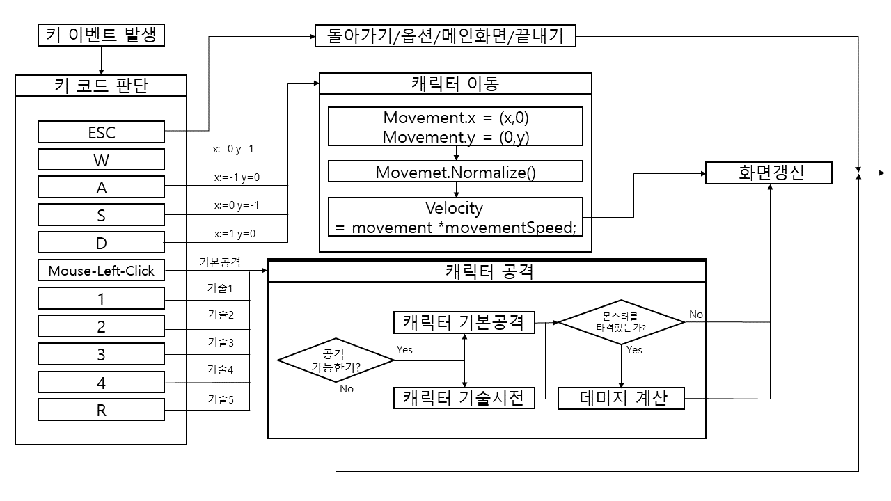

  

## 3. 용어 정리

>- Main Scene(시작화면) : 게임 시작시 첫 화면. 시작, 끝내기 2개의 버튼이 있다.
>- - 화면요소
>- - 타이틀 : 몬스터즈 게임의 타이틀이다.
>- - 시작 버튼 : 클릭 시 시작하기 화면(Data scene)으로 이동한다.
>- - 끝내기 버튼 : 클릭 시 게임을 종료한다.
>- Data scene : 게임 시작하기 화면. 데이터 칸 2개를 볼 수 있다. 데이터 칸을 통해 게임을 시작한다. 
>- - 화면요소
>- - 데이터 칸 : 클릭 시 해당 데이터 칸에 저장되어 있는 데이터를 불러온다.
>- - 스크립트 요소
>- - SaveDataList : 게임 데이터가 저장된 데이터이다.
>- - Playtime : 저장된 게임 데이터 중 게임 플레이 시간을 나타내는 데이터이다.
>- Game scene : 플레이어가 직접적으로 캐릭터를 조종하여 게임을 플레이 할 수 있는 화면이다.
>- - 화면요소
>- - 캐릭터 : 플레이어가 조종할 수 있는 캐릭터. 상하좌우 이동이 가능하다. 전투가 가능한 필드에서는 마우스 좌클릭, 1번키, 2번키, 3번키, 4번키, R키를 사용하여 공격이 가능.
>- - 캐릭터 무기 UI : 화면 좌측 하단에 캐릭터가 착용하고 있는 무기를 나타내는 UI이다.
>- - 캐릭터 체력 UI : 화면 좌측 하단에 캐릭터의 현재 체력을 나타내는 UI이다. 최대 체력과 현재 체력을 표시한다.
>- - 무기고 오브젝트 : 착용 가능한 무기들을 볼 수 있는 오브젝트. 상호작용시 착용 가능한 무기들을 나열한다.
>- - 게시판 오브젝트 : 캐릭터가 전투가 가능한 월드로 보내주는 오브젝트. 상호작용시 월드를 나열한다.
>- - 스크립트 요소
>- - 키코드 : W, A, S, D, ESC, 1, 2, 3, 4, R이 있다. 1, 2, 3, 4, R키는 각각 저장된 skillList와 반응
>- - W : GetAxisRaw(“Vertical”)에 반응, 애니메이션 state를 저장
>- - A : GetAxisRaw(“Horizontal”)에 반응, 애니메이션 state를 저장
>- - S : GetAxisRaw(“Vertical”)에 반응, 애니메이션 state를 저장
>- - D : GetAxisRaw(“Horizontal”)에 반응, 애니메이션 state를 저장
>- - Movement : 각 Horizontal, Vertical에 반응된 값을 저장. 이동방향을 제공
>- - movementSpeed : 제공된 이동방향으로 이동속도 제어. 기본값 3.0f
>- - ESC : 인게임 흐르는 시간을 중지, 일시정지 메뉴 출력
>- - maxHitPoints_cha : 캐릭터의 최대 체력 값
>- - curHitPoints_cha : 캐릭터의 현재 체력 값
>- - hitInterval : 캐릭터가 피격 시 재 피격까지의 간격
>- - DefVal_cha : 캐릭터의 방어력 값
>- - AtkVal_cha : 캐릭터의 공격력 값
>- - Speed_cha : 캐릭터의 이동속도 값. movementSpeed와 합연산
>- - conditionList_cha : 캐릭터의 상태이상 배열 리스트
>- - name_wp : 무기의 이름 데이터
>- - AtkVal_wp : 무기의 공격력 값
>- - AtkInterval_wp : 무기의 공격속도 값
>- - SkillList_wp : 무기의 기술 배열 리스트
>- - Atkvar_wp : 무기의 무기변수 값. 1-5중 하나 값에 따라 데미지 계산 폭이 넓어짐.
>- - name_mob : 몬스터의 이름 데이터
>- - maxHitPoints_mob : 몬스터의 최대 체력 값
>- - curHitPoints_mob : 몬스터의 현재 체력 값
>- - DefVal_mob : 몬스터의 방어력 값
>- - AtkVal_mob : 몬스터의 공격력 값
>- - AP_mob : 몬스터의 방어구 관통력 값
>- - Speed_mob : 몬스터의 이동속도 값
>- - conditionList_mob : 몬스터의 상태이상 배열 리스트
>- - mousePos : 마우스 포인터의 포지션 값을 저장하는 데이터
>- - chaPos : 캐릭터의 포지션 값을 저장하는 데이터
>- - mobPos : 몬스터의 포지션 값을 저장하는 데이터
>- - armoryList : 무기고에 있는 무기 배열 리스트 데이터
>- - worldList : 게시판에 있는 월드 배열 리스트 데이터
>- - Atkvar : 데미지 계산에 사용되는 무기 변수 값
>- - Damage_cha : 캐릭터가 입은 데미지 저장 데이터
>- - Damage_mob : 몬스터가 입은 데미지 저장 데이터
>- - isPlay : 게임 일시정지/실행 상태 esc키로 이벤트 실행

  

# [<strong>개발작업 일정(6주)</strong>]

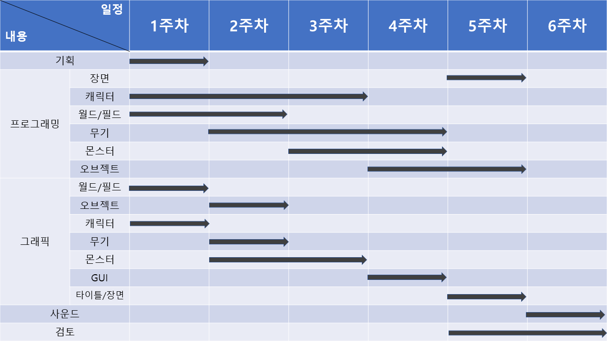

        
